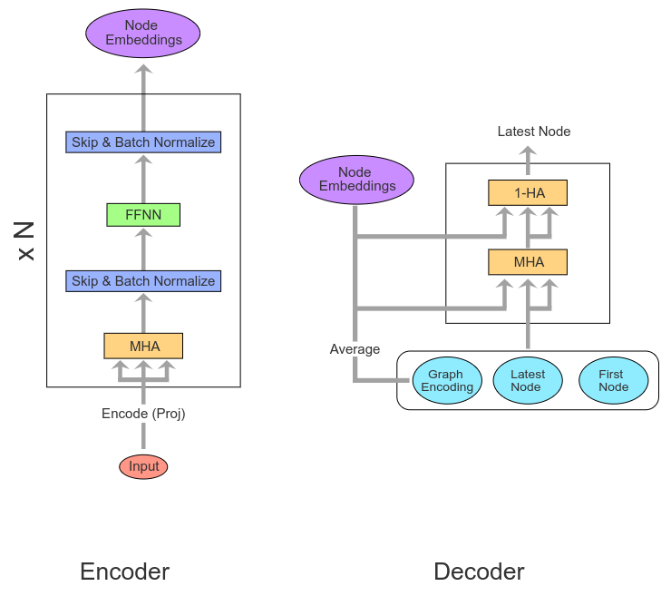

# Attention Model for Vehicle Routing Problems
## Tensorflow 2.0 implementation of <a href="https://arxiv.org/abs/1803.08475">Attention, Learn to Solve Routing Problems!</a> article.

### <a href="https://github.com/d-eremeev/">Dmitry Eremeev</a>, <a href="https://github.com/alexeypustynnikov">Alexey Pustynnikov</a>

This work was done as part of a final project for <a href="http://deeppavlov.ai">DeepPavlov </a> course: <a href="http://deeppavlov.ai/rl_course_2020">Advanced Topics in Deep Reinforcement learning</a>.

Code of the full project (<a href="https://arxiv.org/abs/2002.03282">dynamic version</a>) is located at https://github.com/d-eremeev/ADM-VRP

#### Enviroment:

Current enviroment implementation is located in **Enviroment.py** file - AgentVRP class.

The class contains information about current state and actions that were done by agent.

Main methods:

- **step(action)**: transit to a new state according to the action.
- **get_costs(dataset, pi)**: returns costs for each graph in batch according to the paths in action-state space.
- **get_mask()**: returns a mask with available actions (allowed nodes).
- **all_finished()**: checks if all games in batch are finished (all graphes are solved).

Let's connect current terms with RL language (small dictionary):

- **State**: $X$ - graph instance (coordinates, demands, etc.) together with information in which node agent is located.
- **Action**: $\pi_t$ - decision in which node agent should go.
- **Reward**: The (negative) tour length.

#### Model Training:

AM is trained by policy gradient using <a href="https://link.springer.com/article/10.1007/BF00992696">REINFORCE </a> algorithm with baseline.

**Baseline**

- Baseline is a <b>copy of model</b> with fixed weights from one of the preceding epochs.
- Use warm-up for early epochs: mix exponential moving average of model cost over past epochs with baseline model.
- Update baseline at the end of epoch if the difference in costs for candidate model and baseline is statistically-significant (t-test).
- Baseline uses separate dataset for this validation. This dataset is updated after each baseline renewal.

# Files Description:

 1) **Enviroment.py** - enviroment for VRP RL Agent
 2) **layers.py** - MHA layers for encoder
 3) **attention_graph_encoder.py** - Graph Attention Encoder
 4) **attention_graph_decoder.py** - Graph Attention Decoder
 5) **attention_model.py** - Attention Model
 6) **reinforce_baseline.py** - class for REINFORCE baseline
 7) **train.py** - defines training loop, that we use in train_with_checkpoint.ipynb
 8) **train_with_checkpoint.ipynb** - from this file one can start training or continue training from chechpoint
 9) **generate_data.py** - various auxiliary functions for data creation, saving and visualisation
 10) results folder: folder name is ADM_VRP_{graph_size}_{batch_size}. There are training logs, learning curves and saved models in each folder 
 
 # Training procedure:
  1) Open  **train_with_checkpoint.ipynb** and choose training parameters.
  2) All outputs would be saved in current directory.

Details of Files
=================

`attention_graph_encoder.py`
-----------------------------

The attention graph encoder utilizes an almost-intact encoder architecture from the transformer. There is no positional encoding and several linear projections (Dense layers with no activation) are used for conducting the embedding step.

### `class MultiHeadAttentionLayer`

This class defines a single encoding unit. It will not support embedding (done a-priori). All moving parts as defined in the paper are created in constructor and call function connects them together.

### `class GraphAttentionEncoder`

This class defines the full encoder defined in Kool et al. The constructor sets up the embedding layer. The embedding uses two Dense layers. One for passing only the depot location and another for the rest of nodes. This is important to note since the depot and rest of nodes are not passed through the same embedding layer. Finally, the Multi Headed Attention Layers are stacked together in a list.

The call function simply connects the moving pieces, abstracting away from the multiheaded attention units.

`attention_graph_decoder.py`
----------------------------

### `class GraphAttentionDecoder`

The class contains several methods that abstract the decoder away.

#### `__init__`

Sets up the layers (matrices for linear projections). First, the function stores the expected output dimension (2D points) as well as the number of heads to use in MHA module. Then, the query/key dimensionality is computed, which is used for "controlling" the dot product of compatibility (d_k in literature). We use the same d_k for both the MHA and 1-HA layers. Next,  the tanh clipping (C in literature) is stored as well as the decoding style. There are two styles (Probabilistic or greedily).

The weight matrices (defined as Dense layers) are set up. First, the weight matrix for the Query calculation is split into two matrices: W^Q_c and W^\[Q_step_c\]. W^Q_c will be multiplied with the graph embedding while W^\[Q_step_c\] will be multiplied with the last node embedding and the remaining material. This makes sense since the graph embedding will not change (this is not AM-D!) while the other two will need to be recomputed for certain. the sum of these two multiplications will provide the final Query. Then, two matrices for multiplying keys are created. One matrix is used for computing the Keys for the MHA layer while the other (`wk_tanh`) will be used by the 1-HA layer. Second to last, we create the value matrix, which is only used in the MHA layer (since the 1-HA is only interested in the attention values rather than the final weighted value.) Finally, the last matrix used in computing the last Query in 1-HA is set up as `w_out`. **Note that this weight is equivalent to another W^Q matrix.**

These are the dimensions as defined in the code for each matrix:

| Matrix  | Dimensions |
| :-----: | :--------: |
| wq_context | (d_q_context, output_dim) |
| wq_step_context | (d_q_step_context, output_dim) |
| wk | (d_k, output_dim) |
| wk_tanh | (d_k_tanh, output_dim) |
| wv | (d_v, output_dim) |
| w_out | (d_model, d_model) |

An important thing to note is that the context embedding is the concatenation of graph embedding, last node's embedding, and current left material.

#### `set_decode_type`

This function simply sets up the decoding style. If _greedy_ is chosen, then, the output of the decoder will be argmaxed to obtain the most likely node. If _sampling_ is chosen, then, the probability logits are used to sample for a single next node. See `_select_node` for more information

#### `split_heads`

Reshapes an input tensor to be computable by multi-headed attention layer. In specifics, it from a tensor of shape `batch_size x ...` to a tensor of shapes `batch_size x num_heads x ... x head_depth`
#### `_select_node`

Enforces the output style for the decoder. see `set_decode_type`.

#### `get_step_context`

Will return the step context, which is used for computing the Query (see `__init__` for more). First, we collect the latest node to which we have arrived (see `Environment.py` for more). Then, we retrieve the embedding for the exact same node as it was computed (tf.gather serves as an indexing function). Finally, the step_context is formed by concatenating the embedded latest node (current node we are at) with the remaining vehicle material.

#### `decoder_mha`

Executes the MHA's opperations of the decoder. This function is meant to abstract aways the complex operations used in calculating the attention mechanisms. Since the Query changes every loop, it is left to the calling code to compute the Q, K, and V.

First, we compute the compatibility score by performing a dot product between Q and K. The dot product is then scaled down using sqrt(d_k). Next, using a given mask (usually used for removing information of nodex that are not accessible or have already been visited) the query/keys are masked so that no compatibility score is computed. finally, a softmax is computed over the remaining compatibility scores to produce the attention values. Finally, the final value is computed by performing a dot product on the values with the attention scores. Some transposing and reshaping is then performed to produce the final attention values. The output is finally passed through the final matrix (`w_out`).

#### `get_log_p`

Outputs the final probability distribution for each node to be selected as the next. First, the compatibility scores are computed similar to `decoder_mha`. Then, the values are cliped by passing the through a tanh function and then multiplied by a constant `tann_clipping`. A masked is then applied to remove information from key/values that are inaccesible. finally, logits are calculated using a log softmax function.

#### `call`

The function conducts the inference of the solution to a given input problem. First, the input is converted into a problem object that helps in producing masks (limiting where we can go) and knowing when the problem has been solved. Then, we calculate the Query, Key, and Values. Finally, we loop through the architecture until the problem is deemed solved.

First, the function stores away the node embeddings received as well as the node embeddings calculated from the encoder. The function is set up to work with batches, thus, that information is extracted.

Then, the Query, Key, and Values to be used are computed. Recall that these variables are linear projections with respect to the graph embedding and the input embedding.

`attention_model.py`
--------------------

### `AttentionModel`

#### `__init__`

Stores the information used for the specific encoding/decoding matrices and problem types. Builds the encoder/decoder by simply using instances of `GraphAttentionEncoder` and `GraphAttentionDecoder`.

#### `set_decode_type`

Seems like mostly informative variable setter.

#### `_calc_log_likelihood`

Used on calculating the log likelihood of the entire trajectory created.

#### `call`

Passes the input through the encoder to produce both the node embeddings and the graph embedding (`embeddings` and `mean_graph_emb`). Then, the input graph, node embeddings, and graph embeddings are used for decoding and obtaininb both the logits and returned trajectory/node list (`_log_p` and `pi`). Finally, the cost of following the produced trajectory as well as the log likelihood for each the entire trajectory are calculated and returned. If the trajectory was selected to be returned, then, it is returned.

`Environment.py`
----------------

`generate_data.py`
------------------

`layers.py`
-----------

`reinforce_baseline.py`
-----------------------

`train.py`
----------
